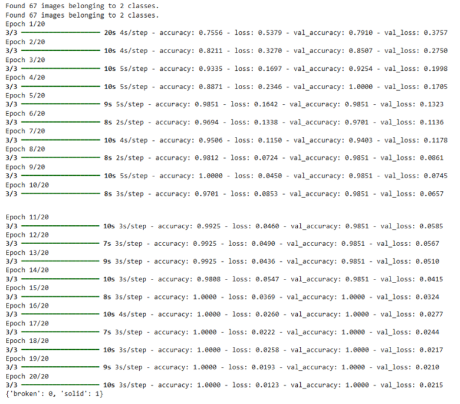
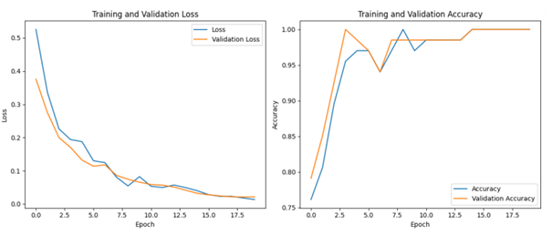
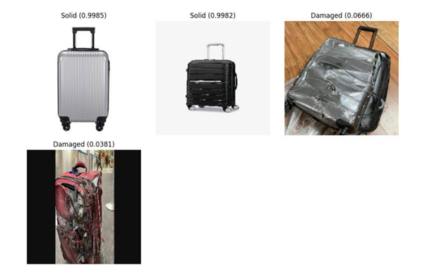

# Introduction
  This code creates a artificial intelligence model for binary image classification using the MobileNetV2 model with transfer learning. Firstly, the necessary libraries are imported and the directories containing the training and validation data are determined by establishing a Google Drive connection. Data augmentation is applied using ImageDataGenerator and training and validation data sets are prepared. Then, the pre-trained weights of the MobileNetV2 model (ImageNet) are used, but the layers of the base model are frozen so that they are not trainable. The final classification is retrained by adding GlobalAveragePooling2D, two fully connected layers and a sigmoid output layer. The model is compiled with Adam optimiser and trained with binary crossentropy loss and accuracy metric. After the training is completed, the images from the test directory are loaded and the predictions of the model are taken. The images are visualised with the predicted labels using Matplotlib. The outputs of the model are designated as ‘Solid’ or ‘Damaged’ and are added to the captions of the images along with the predicted probability.
# Outputs

#

#

#
 As seen in the example above, the model performs successfully on real-world test images. The classification results show high confidence for solid luggage and appropriately low confidence for damaged ones.
